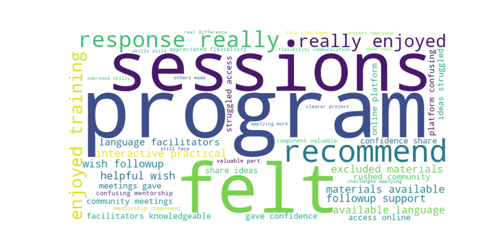
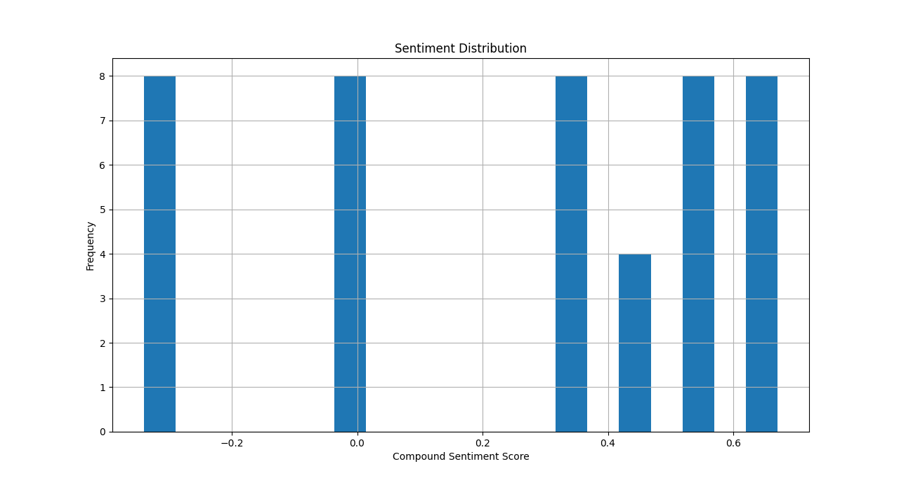

# AI as a Pivot for Automated Qualitative Analysis in Evaluation

The humanitarian sector is undergoing a profound reset. With shrinking budgets and reductions in personnel, organizations are being asked to deliver more credible results with fewer resources. In this new landscape, evaluation is not just a technical exercise, it is a cornerstone of accountability, transparency, and trust. Stakeholders demand evidence that interventions are relevant, effective, and sustainable, and evaluators must rise to the challenge of demonstrating impact under increasing constraints.

At the same time, the AI revolution is reshaping how knowledge is generated and used. Responsible application of artificial intelligence offers a way to adapt to this new normal: automating routine tasks, surfacing insights from complex qualitative data, and enabling evaluators to focus on interpretation and utilization. By leveraging natural language processing (NLP) and interactive dashboards, this project shows how AI can become a pivot point for evaluation practice, helping professionals map responses to established frameworks (DAC and ALNAP), analyze sentiment, and visualize results in ways that strengthen accountability and decision‑making.

This is not about replacing human judgment, but about augmenting it. Responsible AI use ensures that evaluators can meet rising demands for credible evidence while maintaining ethical standards and contextual sensitivity. In short, AI is not just a tool, it is part of the adaptation strategy for evaluation in a humanitarian sector that must do more with less.

---

## Introduction

Evaluation professionals often face the challenge of making sense of large volumes of qualitative data—interviews, focus groups, survey comments, and field notes. This project provides a reproducible pipeline that automates key steps:

- Ingesting documents in multiple formats (TXT, CSV, DOCX, JSON, PDF)
- Cleaning and preprocessing text
- Mapping responses to DAC and ALNAP evaluation criteria
- Performing sentiment analysis
- Visualizing results in an interactive dashboard

The goal is to make qualitative insights more actionable, transparent, and utilization‑focused.

---

## Methods

### Data Ingestion

A flexible loader (`data_loader.py`) reads responses from text files, spreadsheets, Word documents, JSON exports, and PDFs. All content is consolidated into a single dataset.

### Preprocessing

Text is cleaned (lowercasing, punctuation removal, stopword filtering) to prepare for analysis.

### Semantic Mapping

Using transformer embeddings (`sentence-transformers`), responses are matched to evaluation questions under DAC or ALNAP frameworks. This ensures that qualitative evidence is systematically linked to evaluation criteria.

### Sentiment Analysis

The VADER sentiment analyzer assigns each response a compound score, indicating whether feedback is broadly positive, negative, or neutral.

### Visualization

A word cloud showing the most occuring words:




A sentiment distribution:




A Plotly/Dash dashboard displays:

- Counts of responses per criterion
- Average sentiment overlay (green = positive, red = negative)
- A detailed list of responses with their mapped criterion, evaluation question, similarity score, and sentiment score

---

## Results

The pipeline produces:

- **Aggregated insights**: Which criteria are most frequently mentioned
- **Sentiment overlays**: Whether feedback is favorable or critical
- **Response mapping**: Each qualitative input linked to a specific evaluation question

This enables evaluators to quickly identify strengths, weaknesses, and areas requiring deeper investigation.

---

## How to Reproduce

1. **Clone the repository**:

   ```bash
   git clone https://github.com/your-username/automated-qual-analysis.git
   cd automated-qual-analysis
    ````

2. **Install Dependancies**

    ````bash
    pip install -r requirements.txt
    ````

3. **Add your data:**

Place TXT, CSV, DOCX, JSON, or PDF files into the `data/` folder.

4. **Run the pipeline:**

    ````python
    python main.py
    ````

5. **Explore the dashboard:**

   Open your browser at `http://127.0.0.1:8050` (127.0.0.1 in Bing).

6. **Repository**

   View the code on GitHub (github.com in Bing)

---

**Citation**
If you use this project in your evaluation work, please cite:

Automated Qualitative Analysis for Evaluation. GitHub repository, 2026.
<[https://HerzelS.github.io/automated-qual-analysis/](https://github.com/HerzelS/Automated-Qualitative-Data-Analysis-for-Evaluation)> (HerzelS.github.io in Bing)
